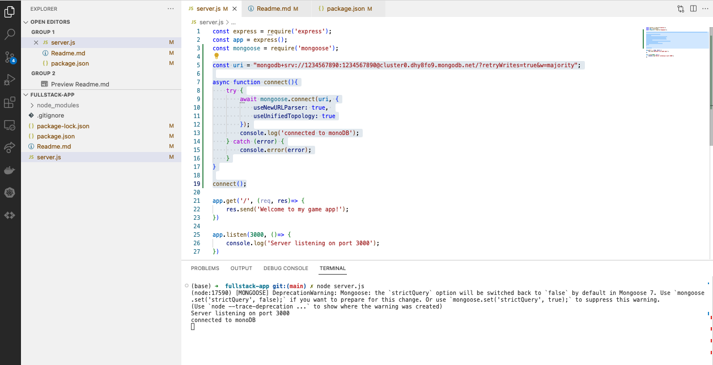
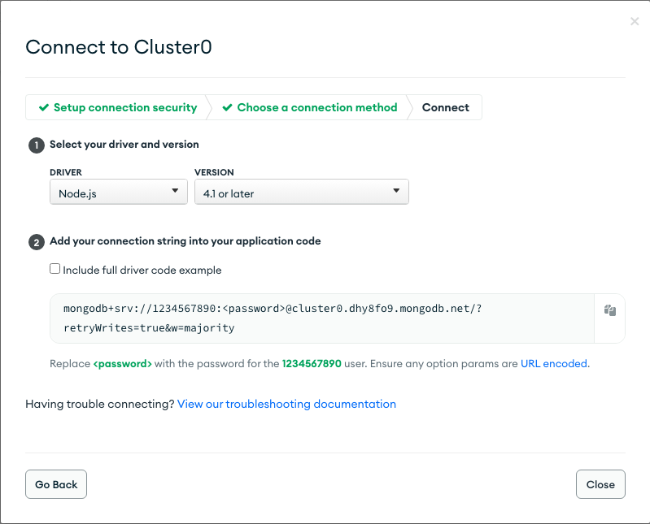

# 18. Establish a Connection to MongoDB with The Express Server ChatGPT

- Install mongoose - `npm i mongoose`

```
const uri = "copy the url from your MongoDB to here";

async function connect(){
    try {
        await mongoose.connect(uri, {
            useNewURLParser: true, 
            useUnifiedTopology: true
        });
        console.log('connected to mongoDB');
    } catch (error) {
        console.error(error);
    }
}

connect();
```

<details>
  <summary>  Server running result picture capture </summary>

<p align="center">  </p>
</details> 


<details>
  <summary>  MongoDB URL picture capture </summary>

<p align="center">  </p>
</details> 
